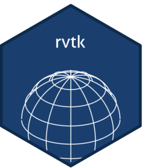

<!-- README.md is generated from README.qmd. Please edit that file -->

```{r}
#| include: false
knitr::opts_chunk$set(
  collapse = TRUE,
  comment = "#>",
  message = FALSE,
  warning = FALSE
)
```

# rvtk 

<!-- badges: start -->
[](https://github.com/astamm/rvtk/actions/workflows/R-CMD-check.yaml)
[](https://app.codecov.io/gh/astamm/rvtk)
[](https://github.com/astamm/rvtk/actions/workflows/pkgdown.yaml)
[](https://CRAN.R-project.org/package=rvtk)
<!-- badges: end -->

**rvtk** is an infrastructure package that makes the
[Visualization Toolkit (VTK)](https://vtk.org/) available to other R packages
that need to link against it. It provides four utility functions —
`CppFlags()`, `LdFlags()`, `LdFlagsFile()`, and `VtkVersion()` — that return
the correct compiler and linker flags for however VTK was found or installed
on the current machine.

## How VTK is located

### macOS and Linux

The `configure` script tries each strategy in order, stopping as soon as one
succeeds:

1. The environment variable `VTK_DIR` (path to a VTK build or install tree).
2. [Homebrew](https://brew.sh/) (`brew --prefix vtk`) — macOS only.
3. `pkg-config` (`vtk-9.5`, `vtk-9.4`, …, `vtk-9.1`).
4. Well-known system prefixes (`/usr`, `/usr/local`) — Linux only.
5. Download pre-built static libraries from
   <https://github.com/astamm/rvtk/releases> as a fallback.

### Windows

The `configure.win` script also tries each strategy in order:

1. The environment variable `VTK_DIR`.
2. Rtools45 `pacman` (queries installed packages; never installs automatically).
3. Common Rtools45 / MSYS2 prefixes
   (`/x86_64-w64-mingw32.static.posix`, `/ucrt64`, `/mingw64`, …).
4. Download pre-built static libraries built with the
   `x86_64-w64-mingw32.static.posix` toolchain from
   <https://github.com/astamm/rvtk/releases> as a fallback.

> **Windows — disabled modules.** The Rtools45 `static.posix` sysroot does
> not provide `netcdf` or `libproj`. Consequently, the following VTK modules
> are **disabled** in the Windows pre-built libraries: `VTK_IONetCDF`,
> `VTK_IOHDF`, `VTK_GeovisCore`, `VTK_RenderingCore`. Downstream packages
> that require any of these modules cannot currently be built on Windows.

### Platform and VTK-strategy compatibility

| Platform | VTK strategy | Supported |
|---|---|---|
| macOS arm64 | System (Homebrew, shared) | ✔ |
| macOS arm64 | Pre-built static (automatic fallback) | ✔ |
| macOS arm64 | Custom `VTK_DIR` (static or shared) | ✔ |
| macOS x86_64 | System (Homebrew, shared) | ✔ |
| macOS x86_64 | Pre-built static (automatic fallback) | ✔ |
| macOS x86_64 | Custom `VTK_DIR` (static or shared) | ✔ |
| Linux x86_64 (glibc) | System (apt / pkg-config, shared) | ✔ |
| Linux x86_64 (glibc) | Pre-built static (automatic fallback) | ✔ |
| Linux x86_64 (glibc) | Custom `VTK_DIR` (static or shared) | ✔ |
| Linux x86_64 (musl / Alpine) | Pre-built static (automatic fallback) | ✔ |
| Linux x86_64 (musl / Alpine) | Custom `VTK_DIR` (static or shared) | ✔ |
| Linux aarch64 | System (apt / pkg-config, shared) | ✔ |
| Linux aarch64 | Pre-built static (automatic fallback) | ✔ |
| Linux aarch64 | Custom `VTK_DIR` (static or shared) | ✔ |
| Windows | Pre-built static (automatic fallback) | ✔ |
| Windows | Pre-built shared DLLs (`VTK_LINK_TYPE=shared`) | ✔ |
| Windows | Custom `VTK_DIR` with static `.a` libs | ✔ |
| Windows | Custom `VTK_DIR` / pacman / MSYS2 with static `.a` libs | ✔ |
| Windows | Custom `VTK_DIR` / pacman / MSYS2 with shared libs only | ✔ |

::: {.callout-note title="Windows: choosing static vs. shared on the pre-built fallback"}
By default the pre-built fallback downloads static `.a` libraries, which is
the right choice for CRAN packages (no DLL dependencies for end users, no
run-time path configuration).

To opt into the pre-built shared-DLL build instead, set the `VTK_LINK_TYPE`
environment variable **before** installing **rvtk**:

```sh
VTK_LINK_TYPE=shared Rscript -e 'pak::pak("astamm/rvtk")'
```

or in an R session:

```r
Sys.setenv(VTK_LINK_TYPE = "shared")
pak::pak("astamm/rvtk")
```

When `VTK_LINK_TYPE=shared` the installer downloads
`vtk-X.Y.Z-shared-posix-x64.zip`, places the DLLs in
`inst/vtk-dlls/`, and records `VTK_LINK=shared` in `vtk.conf`. An `.onLoad`
hook prepends that directory to `PATH` via `Sys.setenv()` when rvtk is
loaded, so downstream packages require no extra configuration.

Configuration results are stored in `inst/vtk.conf` and read at run time by
`CppFlags()`, `LdFlags()`, and `VtkVersion()`.
:::

::: {.callout-important title="Downstream package developers using Windows shared VTK"}
When **rvtk** is installed with `VTK_LINK_TYPE=shared` (or when a system
installation with only shared libs is detected), downstream packages link
against VTK `.dll.a` import libraries and load the VTK DLLs from rvtk's
`inst/vtk-dlls/` at run time.

This has two implications that downstream package authors should communicate
to their users:

1. **rvtk and the downstream package must be kept in sync.**
   The downstream package is compiled against the specific VTK version (and
   DLL ABI) shipped with the rvtk version installed at compile time. If rvtk
   is later updated to a new VTK version (e.g. 9.5 → 9.6), the downstream
   package must be **recompiled** against the new rvtk to match the new DLL
   names (e.g. `vtkCommonCore-9.6.dll`). Binary packages compiled against
   an older rvtk will fail to load.

2. **DLL footprint grows in rvtk only.**
   The VTK DLLs are staged inside **rvtk**'s own `inst/vtk-dlls/` directory.
   Downstream packages do **not** receive a copy — they rely on rvtk's
   `.onLoad` hook prepending that directory to `PATH` at run time. Each
   additional VTK module added to the pre-built DLL set therefore increases
   the install-time and CRAN size cost of **rvtk** only, not of downstream
   packages. To request additional modules, open an issue on the rvtk
   repository.

> For CRAN submissions, the static pre-built build (default) is recommended
> because it has no run-time coupling to rvtk's DLLs and is
> self-contained within the downstream package binary.
:::

## Available VTK modules

The pre-built bundles shipped with **rvtk** are built with
`VTK_BUILD_ALL_MODULES=OFF` and the following modules explicitly enabled
(VTK resolves and includes all transitive dependencies automatically):

| Module | Purpose |
|---|---|
| `VTK_IOLegacy` | Legacy VTK file format reader/writer (`.vtk`) |
| `VTK_IOXML` | XML-based VTK file formats (`.vtp`, `.vtu`, `.vts`, …) |
| `VTK_IOCore` | Core I/O infrastructure shared by all I/O modules |
| `VTK_CommonCore` | Core data structures, object model, logging |
| `VTK_CommonDataModel` | Datasets, cells, point/cell data arrays |

Typical transitive dependencies pulled in automatically include
`VTK_CommonExecutionModel`, `VTK_CommonMath`, `VTK_CommonMisc`,
`VTK_CommonSystem`, `VTK_CommonTransforms`, `VTK_IOXMLParser`, and `vtksys`.

On Windows the modules `VTK_IONetCDF`, `VTK_IOHDF`, `VTK_GeovisCore`, and
`VTK_RenderingCore` are additionally **disabled** because `netcdf` and
`libproj` are not available in the Rtools45 `static.posix` sysroot.

To link against only the modules your package needs — which avoids pulling in
unwanted symbols, such as AppKit/Cocoa symbols from rendering modules on macOS
static bundles — pass the `modules` argument to `LdFlagsFile()` (or
`LdFlags()`):

```sh
VTK_LIBS="$("${R_HOME}/bin/Rscript" --vanilla -e \
  "rvtk::LdFlagsFile('src/vtk_libs.rsp', modules = c('VTK_IOLegacy', 'VTK_CommonCore'))")"
```

When `modules = NULL` (the default), all available modules are linked, which
is safe when using a system VTK installation that provides only shared
libraries.

## Installation

```r
# install.packages("pak")
pak::pak("astamm/rvtk")
```

A system VTK installation (≥ 9.1.0) is not required: if none is found the
package downloads pre-built static libraries automatically.

## Usage for downstream package developers

### Quick setup with `use_rvtk()`

The easiest way to configure a downstream package is to call `use_rvtk()`
from the root of that package. It handles everything in one step:

```r
rvtk::use_rvtk()
```

This will:

1. Add `rvtk` to `Imports` in `DESCRIPTION`.
2. Write `src/Makevars` and `src/Makevars.win` that resolve VTK compiler and
   linker flags at install time by calling a small R helper script.
3. Write `tools/configure.R` that calls `rvtk::CppFlags()` and
   `rvtk::LdFlagsFile()`.
4. Add `src/vtk_libs.rsp` to `.gitignore`.
5. Create `R/rvtk_imports.R` with a minimal `@importFrom rvtk` tag so that
   `R CMD check` does not warn about an unused `Imports` entry.

The `modules` argument lets you restrict linking to only the VTK modules
your package actually needs (strongly recommended on macOS to avoid pulling
in AppKit/Cocoa symbols from the static bundle):

```r
rvtk::use_rvtk(
  modules = c(
    "vtkIOLegacy",
    "vtkIOXML",
    "vtkCommonCore",
    "vtkCommonDataModel"
  )
)
```

### Manual setup

If you prefer to set up the files manually, add **rvtk** to the `Imports`
field of `DESCRIPTION`:

```
Imports: rvtk
```

Then create the following three files.

#### `src/Makevars`

```makefile
PKG_CPPFLAGS = `"$(R_HOME)/bin/Rscript" ../tools/configure.R --cppflags`
PKG_LIBS = `"$(R_HOME)/bin/Rscript" ../tools/configure.R --libs`
```

#### `src/Makevars.win`

```makefile
PKG_CPPFLAGS = $(shell "$(R_HOME)/bin$(R_ARCH_BIN)/Rscript" ../tools/configure.R --cppflags)
PKG_LIBS = $(shell "$(R_HOME)/bin$(R_ARCH_BIN)/Rscript" ../tools/configure.R --libs)
```

#### `tools/configure.R`

```r
args <- commandArgs(trailingOnly = TRUE)
flag <- if (length(args)) args[1L] else "--cppflags"

vtk_modules <- c(
  "vtkIOLegacy",
  "vtkIOXML",
  "vtkIOXMLParser",
  "vtkIOCore",
  "vtkCommonCore",
  "vtkCommonDataModel",
  "vtkCommonExecutionModel",
  "vtkCommonMath",
  "vtkCommonMisc",
  "vtkCommonSystem",
  "vtkCommonTransforms",
  "vtksys"
)

if (flag == "--cppflags") {
  rvtk::CppFlags()
} else if (flag == "--libs") {
  rvtk::LdFlagsFile(path = "vtk_libs.rsp", modules = vtk_modules)
}
```

Adjust `vtk_modules` to the subset of VTK modules your package requires.

`LdFlagsFile()` is preferred over `LdFlags()` for the linker flags because
the full set of VTK `-l` flags can exceed the 8 191-character Windows
command-line limit. `LdFlagsFile(path)` writes the flags to a response file
and returns the short `@path` token that GNU ld and LLVM lld both support;
on macOS and Linux the raw flags are returned directly.

Add `src/vtk_libs.rsp` to `.gitignore` (it is generated at install time).

Import at least one **rvtk** function in your R code to satisfy `R CMD check`:

```r
# R/rvtk_imports.R
#' @importFrom rvtk CppFlags LdFlagsFile
NULL
```

## Querying the detected installation

You can verify the detected installation at any time:

```{r}
library(rvtk)
CppFlags()
LdFlagsFile(tempfile(fileext = ".rsp"))
VtkVersion()
```
